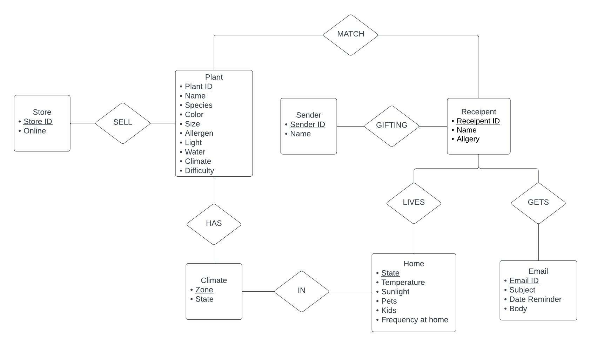

# Phase 2 documentation
This folder contains individual artifacts for successful completion of Phase 2 submission.

This file contains the overall submission, with embedded images or links to relevant files, either within this folder or not.

# Problem Statement
Finding the exceptional plant that is best suited for yourself or a loved one can be a rather difficult task especially if you are not well versed in horticulture. There are many moving components that come into play when finding the right plant. Every plant has a different set of needs to live and continue to grow. Each plant needs a certain amount of sunlight and water, problems can occur if they get too little or too much of this. The plant's size can vary as well, you want to make sure you choose the right size of plant as they can greatly vary in size. These may seem like the only issues in finding the right plant but there are other risks associated with getting the wrong plant. We want to make sure everyone gets the correct plant for them and their household. Some additional factors that are important are climate/location, some plants can only live in certain areas so we need to make sure we have a plant that is suitable for each person's location and climate. We also need to keep in mind the home environment such as the temperature, some plants have specific temperature needs. The amount of sunlight the plant will get and needs varies in each household. The frequency or availability for the owner to be at home comes into play so they are able to water their plant often enough if necessary. We also need to be wary of pets or children in the household, specific plants can be toxic to your pets or they can be allergic to certain plants. We also need to account for children, some plants can harm children such as cactus with their needles. Pricing also matters, each individual has their own desired price range and plants vary greatly in their cost.

We will be creating a program that addresses all these factors in choosing the perfect plant for you and your household. We will ask a series of questions to determine the best species or options of plants that would work best for you or a friend. The program will filter through all the available options and take into account all the choices the user selects to give you options of suitable plants.

## Entity-relationship Diagram

# Lessons Learned
* Start project earlier
* Have reoccurring meetings weekly/bi-weekly

# How The Semester Project Can Be Improved
* 

# Web Application Link: 

# Presentation Video Link:
